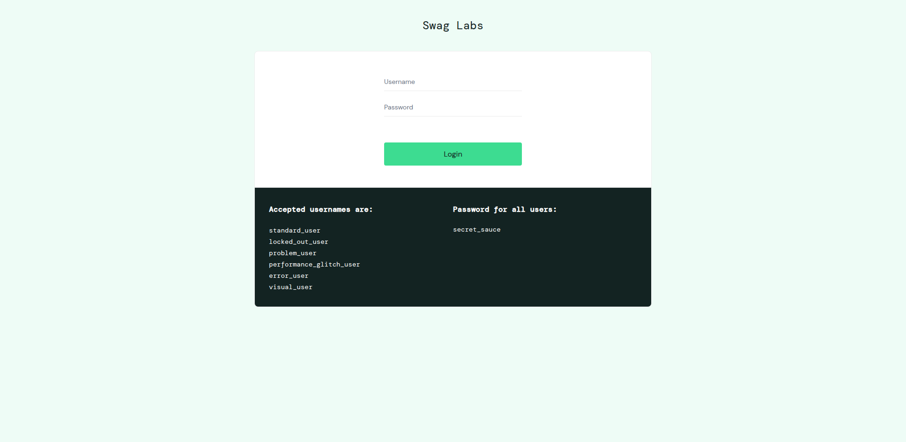
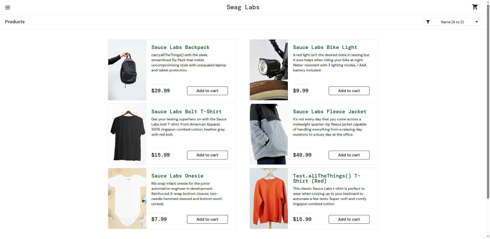
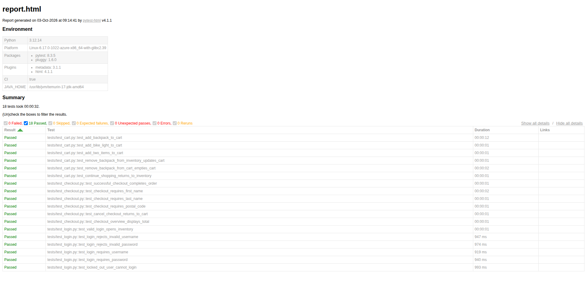

# SauceDemo Selenium + Python + pytest

A portfolio-ready UI automation framework for [SauceDemo](https://www.saucedemo.com/) using **Python, Selenium WebDriver, pytest, and the Page Object Model (POM)**.

The project demonstrates maintainable test design, explicit waits, reusable fixtures, failure screenshots, self-contained HTML reporting, and GitHub Actions CI.

## What is covered

The suite contains **18 automated tests**:

| Area | Tests | Coverage |
| --- | ---: | --- |
| Login | 6 | Valid login, invalid credentials, required fields, locked-out user |
| Cart | 6 | Add one/two products, remove products, cart state, continue shopping |
| Checkout | 6 | Successful order, required-field validation, cancel flow, overview total |

All tests use the login, cart, or checkout pytest marker.

## Framework structure

~~~
saucedemo-selenium-automation/
├── .github/workflows/tests.yml
├── docs/images/                         # Real Selenium evidence screenshots
│   ├── login-page.png
│   ├── inventory-page.png
│   └── pytest-report.png
├── pages/
│   ├── base_page.py
│   ├── login_page.py
│   ├── inventory_page.py
│   ├── cart_page.py
│   └── checkout_page.py
├── reports/
│   └── screenshots/                     # Failure screenshots; git-ignored
├── scripts/
│   └── capture_portfolio_screenshots.py
├── tests/
│   ├── test_login.py
│   ├── test_cart.py
│   └── test_checkout.py
├── conftest.py
├── pytest.ini
├── requirements.txt
└── README.md
~~~

### Page Object Model

- Locators and Selenium interactions live in pages/.
- Tests contain business flows and assertions, not raw Selenium locators.
- BasePage centralizes explicit wait helpers.
- conftest.py provides reusable browser, credentials, login, and checkout fixtures.

### Synchronization

The framework uses WebDriverWait with Selenium expected conditions. There is **no time.sleep()**.

### Credentials

The public SauceDemo demo credentials are used by default:

- Username: standard_user
- Password: secret_sauce

They are overridable without changing source code:

~~~
SAUCE_USERNAME=your_user
SAUCE_PASSWORD=your_password
BASE_URL=https://www.saucedemo.com/
HEADLESS=true
~~~

On Windows PowerShell:

~~~
$env:SAUCE_USERNAME="your_user"
$env:SAUCE_PASSWORD="your_password"
$env:HEADLESS="true"
~~~

## Installation

Prerequisites:

- Python 3.12 recommended
- Google Chrome
- Git

Create and activate a virtual environment:

### Windows

~~~
python -m venv .venv
.venv\Scripts\activate
~~~

### macOS/Linux

~~~
python3 -m venv .venv
source .venv/bin/activate
~~~

Install the pinned dependencies:

~~~
python -m pip install --upgrade pip
pip install -r requirements.txt
~~~

## Run the tests

The default configuration is headless Chrome:

~~~
pytest
~~~

Run a headed browser by overriding the environment variable:

~~~
HEADLESS=false pytest
~~~

Run a specific suite:

~~~
pytest -m login
pytest -m cart
pytest -m checkout
~~~

Run Firefox:

~~~
pytest --browser=firefox
~~~

The default pytest configuration creates a self-contained report at:

~~~
reports/report.html
~~~

## Failure evidence

When a test fails, pytest captures a screenshot under:

~~~
reports/screenshots/
~~~

Those screenshots are attached to the pytest HTML report and are ignored by Git so local/CI failure artifacts do not clutter the repository.

## Screenshots

These images are captured from real Selenium runs; they are not mockups.

### SauceDemo login page

### SauceDemo inventory page

### Pytest HTML report

## CI/CD

GitHub Actions runs the full suite on:

- every push to main
- pull requests targeting main
- manual workflow_dispatch

The workflow uses **Python 3.12**, pip dependency caching, headless Chrome, and the pinned requirements file. Test reports and failure screenshots are uploaded as workflow artifacts.

After a successful main-branch run, the workflow captures the three portfolio screenshots with Selenium and commits updated evidence images under docs/images/.

## Portfolio highlights

This project demonstrates:

- Page Object Model design
- 18 meaningful UI tests
- Explicit Selenium waits
- pytest fixtures and markers
- Environment-overridable credentials
- Headless CI execution
- Self-contained HTML reporting
- Automated failure screenshots
- Real browser evidence checked into the README
- GitHub Actions test automation
